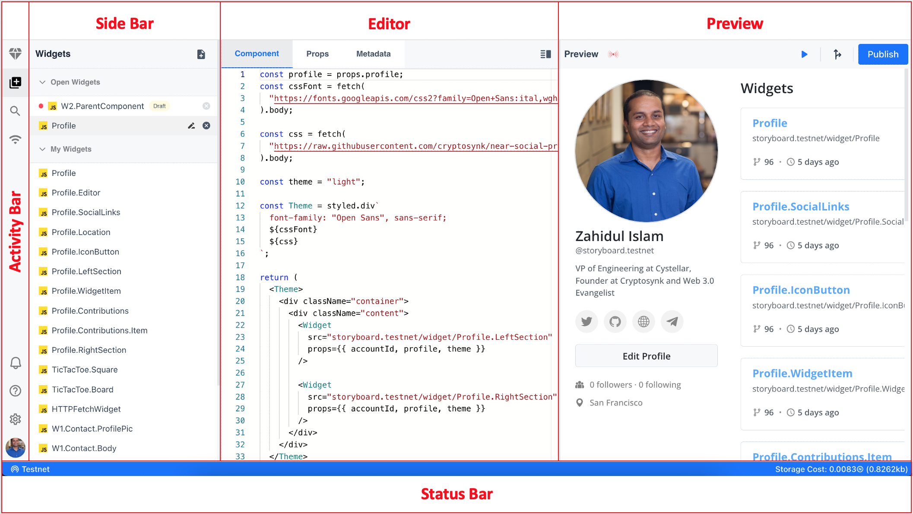

# Editor

At its heart, NEARpad is a code editor. Like many other code editors, NEARpad adopts a common user interface and layout of an explorer on the left, showing all of the widgets you have access to, and an editor on the right, showing the content of the widgets you have opened and a live preview.

# Basic Layout

NEARpad comes with a simple and intuitive layout for the editor while leaving ample room to browse and access the full context of your widgets. The UI is divided into five areas:

- Editor - The main area to edit your widgets.
- Preview - Live preview of your widgets
- Side Bar - Contains list of currently open widgets and all your widgets from the network (mainnet/testnet) that you are currently working on.
- Status Bar - Information about the current network (mainnet/testnet) and the estimated cost of currently open widget in the editor.
- Activity Bar - Located on the far left-hand side, this lets you switch between views.
