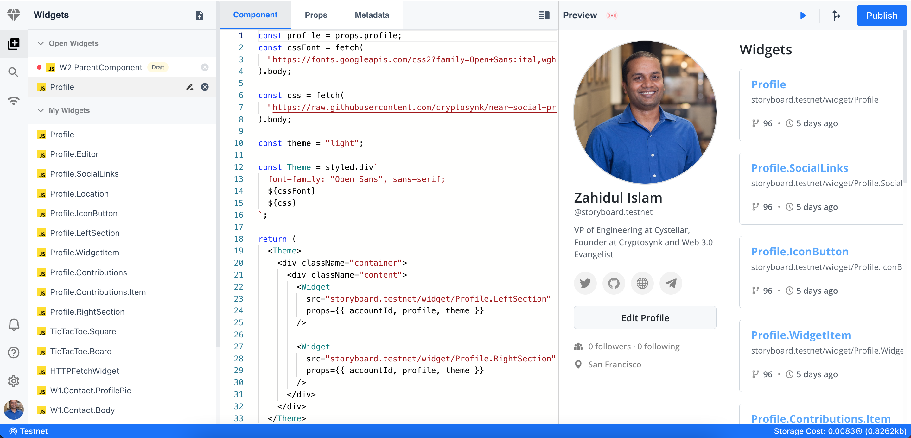
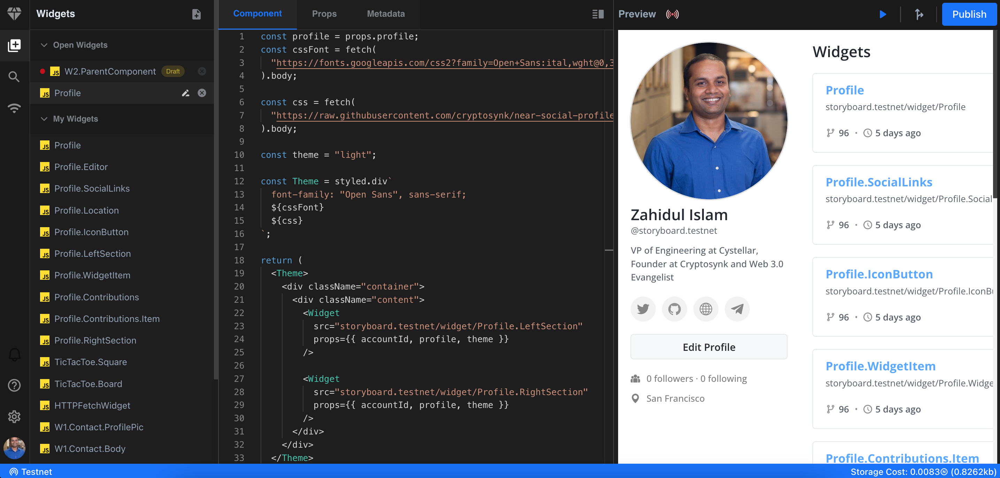

# What is NEARpad?

NEARpad is a web IDE for the Block Chain Operating System (BOS). It's powered by NEAR Social VM and Discovery gateway.

|          Light mode          |          Dark mode          |
| :--------------------------: | :-------------------------: |
|  |  |

# Why should I use NEARpad?

NEARpad is simple, easy-to-use, and developer-friendly.

With our Web IDE, you'll have access to a fully customizable workspace that fits your unique coding style. We offer a wide range of themes and plugins to help you customize your workspace, so you can work the way you want to. Plus, our Web IDE is fully cloud-based, meaning you can access your code from anywhere, at any time, without worrying about syncing or version control.

# Key features:

- Beautiful Code editor with light and dark themes
- Live widget preview and real-time feedback
- Seamlessly switch between Mainnet and Testnet
- One click deploy to Mainnet and Testnet
- Import third party widgets in your code in one click

# What is NEARpad used for?

- Delightful code editing
- Interactive playgrounds
- Quick demos
- Build educational experiences
- Rapid prototyping
